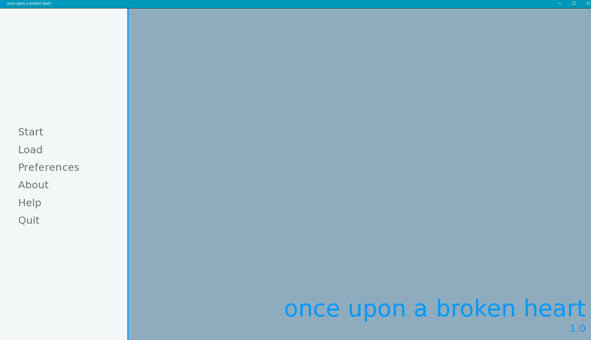

# Once upon broken heart

참여자 : 박사무엘 (개인 프로젝트)

---
**프로젝트 도구:**  
Ren'py, Stable Diffusion, OpenAI API, Notion  

**사용 언어:**  
python
---

 

### ****프로젝트 개요**** 

Ren'py 기반 "once upon broken heart" 2차 창작 게임

### 프로젝트 배경       <!-- 배경 --> 

  

외국 미국에서 유명한 로맨스 판타지 소설 "once upon broken heart" 을 2차 창작하여 게임화한 프로젝트입니다.

주인공 (Jacks) 을 AI 화 하여 User가 좋아하는 이야기를 진행하며 이야기의 일부로써 몰입감을 가지고 소설의 일부처럼 느끼며 게임을 즐기기 위한 목적으로 진행하게 되었습니다.

 

 

### 프로젝트 진행 과정      <!-- 프로젝트의 진행과정 --> 

1. 캐릭터 설정

캐릭터 설정 문서 또는 나무위키 PDF 를 통해 캐릭터 설정 문서화  
캐릭터 프롬프트 생성  
캐릭터 평가 시스템 개발 (5점 만점 기준)  
실시간 감정 변화 시스템 구현 (희로애락 표현)   

2. 시나리오 개발

이야기 플롯 구상 및 작성  
주요 이벤트 설계 및 구현 방식 기획   

3. 비주얼 디자인

애니메이션 스타일의 아트워크 제작  
배경 이미지 디자인  
기타 필요 이미지 assets 생성   

4. 게임 개발

Ren'Py 엔진을 사용한 게임 제작   

---

### 프로젝트 구현 내용  <!-- 프로젝트내에서 의 나의 활동 내용에 대해서는 간단하게 개론의 정도로 --> 

- 캐릭터 AI 모델 개발

OpenAI Assistant API 를 통해 캐릭터 AI 모델 개발 

 

- 시나리오 개발

책이 시리즈로 이루어져 있어 모든 내용을 구현하기에는 시간이 부족함이 있어 캐릭터 관련 스토리로 Chapter 1 만 구현하는 식으로 진행하였습니다.  이 소설을 좋아한 지인을 통해 Fanfic 처럼 2차 창작 시나리오를 개발하였습니다.

 

- Stable Diffusion 을 통한 비주얼 디자인

캐릭터 설정에 따른 Stable Diffusion prompt 를 제작하여 캐릭터 이미지를 생성하였습니다.  
게임에 쓰이는 배경 이미지 또한 Stable Diffusion 을 통해 생성하였습니다.  

(추후 이러한 캐릭터 시트를 통해 LoRA 모델 train 진행 예정)

 

- 게임 개발

Game 은 Day 1 에서 3 까지 진행하는 식으로 진행하였습니다.

하루 마다 선택지와 채팅을 통해 호감도를 쌓아 캐릭터와 관련된 이야기를 진행하는 식으로 진행하였습니다.

Day 에 지정된 호감도를 쌓지 못하는 경우 다음 날로 넘어가지 못하고 bad endding을 맞이하는 식으로 진행하였습니다.

 

위 기능들을 구현하기 위해서 아래와 같은 부분들을 고려하여 구현하였습니다.

1. 하루 별 호감도 측정 및 진행 기능
2. AI response 에 따른 호감도 측정 기능
3. 시나리오 스크립트에 따른 bad endding 시나리오를 parsing 기능 
4. OpenAI Assistant API 를 통한 AI 챗봇 기능
-> [RenPyChatGPTExample github](https://github.com/Taiko3615/RenPyChatGPTExample) 참고하여 구현

이후 추가적인 게임 개발을 진행하였습니다.

---

  

### 프로젝트 한계 및 개선 방안      <!-- 프로젝트 한계 및 개선 방안은 있었는지? (고뇌) -->

**한계**

python 언어가 익숙하더라도, ren'py 가 쓰는 게임엔진 자체에 익숙하지 않아 초반에 많은 시간이 소요되었습니다.

게임엔진과 언어는 별개로 생각하고 공부를 할 수 있었습니다.

API 통신이며 Ren'py 엔진 자체가 동기적으로 작동하기 때문에 API 를 통해 채팅 기능 속도가 느린 점이 있었습니다.

LoRA 학습과 TTS 기능을 구현을 해보고 싶었으나, 시간이 부족함이 많이 아쉬웠다.

프롬프트를 통해서 AI 의 방향을 유도하고 하는게 생각보다 더 어렵고 조그만한 차이에 따라 응답이 많이 바뀔 수 있는것 때문에, 프롬프트 작업이 많이 어려웠습니다.

 

**개선 방안 및 추후 계획**

채팅 반응 속도 개선  

LoRA 학습 진행 및 캐릭터 표정 세트 제작  

더 자연스러운 Live2d 표정 구현  

TTS 기능 구현
